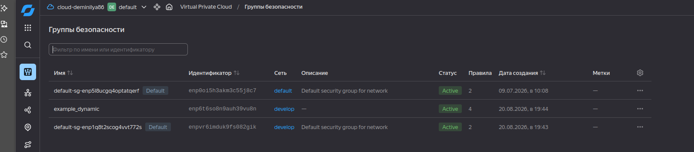
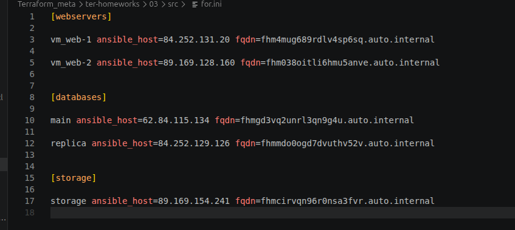

# Домашнее задание «Terraform. Yandex Cloud»

| | |
|---|---|
| **Студент** | Демин Илья Викторович |
| **GitHub репозиторий** | https://github.com/deminilyadev-maker/terraform-03.git |

---

# Оглавление

- [Задание 1](#задание-1)
- [Задание 2](#задание-2)
- [Задание 3](#задание-3)
- [Задание 4](#задание-4)

---

# Задание 1

## Шаг 1. Изучение проекта и инициализация

Был изучен исходный Terraform-проект и выполнена его инициализация для работы с Yandex Cloud.

Для подключения к Yandex Cloud использовались переменные проекта и настроенный провайдер Yandex.

---

## Шаг 2. Группа безопасности

Была создана группа безопасности с входящими правилами для необходимых сервисов:

- SSH — TCP/22;
- HTTP — TCP/80;
- HTTPS — TCP/443.

Также настроено правило для исходящего трафика.

### Скриншот



---

# Задание 2

## Шаг 1. Создание двух Web VM с помощью `count`

Для создания двух одинаковых виртуальных машин `web-1` и `web-2` использован мета-аргумент:

```hcl
count = 2
```

Имя виртуальной машины формируется с использованием индекса:

```hcl
name = "${var.vm_web.name}-${count.index + 1}"
```

Таким образом, создаются две ВМ с одинаковыми параметрами, но разными именами.

Для виртуальных машин назначена группа безопасности, созданная в задании 1.

---

## Шаг 2. Создание Database VM с помощью `for_each`

Для создания двух виртуальных машин баз данных используются имена:

- `main`;
- `replica`.

Параметры ВМ вынесены в общую переменную типа `list(object)`:

```hcl
variable "each_vm" {
  type = list(object({
    vm_name     = string
    cpu         = number
    ram         = number
    disk_volume = number
    core_fraction = number
    preemptible   = bool
  }))

  default = [
    {
      vm_name     = "main"
      cpu         = 2
      ram         = 4
      disk_volume = 20
      core_fraction = 20
      preemptible   = true
    },
    {
      vm_name     = "replica"
      cpu         = 4
      ram         = 8
      disk_volume = 30
      core_fraction = 20
      preemptible   = true
    }
  ]
}

```

Для виртуальных машин заданы разные параметры CPU, RAM и диска.


Создание ВМ выполняется с использованием мета-аргумента `for_each`.

---

## Шаг 3. Использование функции `file()`

Для получения публичного SSH-ключа используется функция `file()`.

Ключ считывается в локальную переменную:

```hcl
locals {
  ssh_public_key = file(pathexpand("~/.ssh/id_rsa.pub"))
}
```

Полученное значение используется при формировании `metadata` виртуальных машин.

---

## Шаг 4. Общая переменная `map(object)` для metadata

Для блока `metadata` создана общая переменная типа `map(object)`:

```hcl
variable "metadata" {
  type = map(object({
    serial-port-enable = number
    ssh-keys           = string
  }))
}
```

Для всех виртуальных машин используется общий объект:

```hcl
metadata = local.metadata
```

Это позволяет избежать дублирования одинаковых значений `metadata` в каждом ресурсе.

---

# Задание 3

## Шаг 1. Создание виртуальных дисков

Созданы три одинаковых виртуальных диска размером 1 ГБ.

Для создания дисков используется ресурс:

```hcl
yandex_compute_disk
```

и мета-аргумент:

```hcl
count
```

Таким образом, создаётся три одинаковых дополнительных диска.

---

## Шаг 2. Создание VM `storage`

Создана отдельная виртуальная машина с именем:

```text
storage
```

Для этой ВМ запрещено использование `count` и `for_each`, так как по условию задания она должна быть одиночной.

---

## Шаг 3. Подключение дополнительных дисков

Созданные диски подключаются к VM `storage` с использованием динамического блока:

```hcl
dynamic "secondary_disk"
```

В качестве источника дисков используется:

```hcl
for_each
```

Таким образом, количество подключаемых дисков определяется автоматически количеством созданных ресурсов `yandex_compute_disk`.

---

# Задание 4

## Шаг 1. Создание динамического Ansible inventory

Для генерации inventory создан файл:

```text
hosts.tftpl
```

Для обработки шаблона используется функция:

```hcl
templatefile()
```

Результат записывается в файл:

```text
for.ini
```

с помощью ресурса:

```hcl
local_file
```

---

## Шаг 2. Группы inventory

Inventory является динамическим и содержит три группы:

```ini
[webservers]

[databases]

[storage]
```

В группу `webservers` автоматически попадают все созданные Web VM.

В группу `databases` попадают виртуальные машины `main` и `replica`.

В группу `storage` попадает отдельная VM `storage`.

Количество виртуальных машин не зафиксировано непосредственно в шаблоне. Использование циклов позволяет обрабатывать различное количество экземпляров.

---

## Шаг 3. Параметры виртуальных машин в inventory

Для каждой виртуальной машины в inventory указываются:

- имя VM;
- внешний IP-адрес через `ansible_host`;
- полное доменное имя через `fqdn`.

Пример:

```ini
[webservers]
vm_web-1 ansible_host=<external-ip> fqdn=<fqdn>
vm_web-2 ansible_host=<external-ip> fqdn=<fqdn>

[databases]
main ansible_host=<external-ip> fqdn=<fqdn>
replica ansible_host=<external-ip> fqdn=<fqdn>

[storage]
storage ansible_host=<external-ip> fqdn=<fqdn>
```

---

## Шаг 4. Получившийся inventory

В результате Terraform сформировал файл `for.ini`, содержащий все пять виртуальных машин и три требуемые группы.

### Скриншот



---

# Результат

В результате выполнения домашнего задания:

- создана и настроена группа безопасности;
- созданы две Web VM с использованием `count`;
- созданы две Database VM с использованием `for_each`;
- параметры Database VM вынесены в общую переменную типа `list(object)`;
- реализовано чтение SSH-ключа с помощью `file()`;
- создана общая переменная `map(object)` для `metadata`;
- созданы три дополнительных диска с использованием `count`;
- создана отдельная VM `storage`;
- дополнительные диски подключены через динамический блок `secondary_disk` и `for_each`;
- создан динамический Ansible inventory с помощью `templatefile()`;
- inventory содержит группы `webservers`, `databases` и `storage`;
- для каждой VM указаны `ansible_host` и `fqdn`.

Все Terraform-конфигурации и необходимые скриншоты находятся в репозитории проекта.
